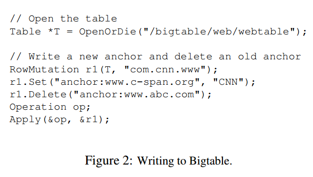
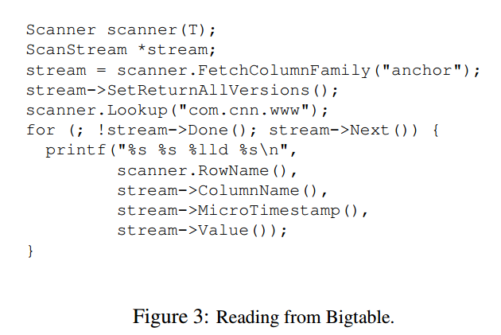
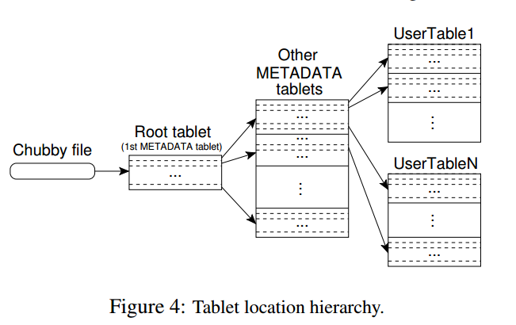
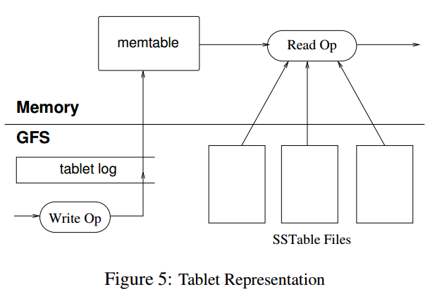

# 1. Introduction

本文为读bigtable的总结，分为以下部分：

- Data Model
- API
- Building Blocks
- Implementation
- Refinements

# 2. Data Model

bigtable本质上是一个K/V存储，其中映射关系为：

```
(row:string, column:string, time:int64)->string
```

如上所示，key为`row:string, column:string, time:int64`, value为`string`

以一个例子来说明该映射关系，如下图：


如上图所示，表名为`WebTable`，以URL为row key，网页各方面属性为column name，其中网页内容存储在contents:列中，通过时间戳可以区分列的数据版本。

## 2.1 Rows

Row key可以是任意的字符串，大小不超过64KB。每次针对单行的操作都是原子操作。

Bigtable按照row key的字典序对数据排序，每张表按照row key的排序范围动态划分。每个划分的row范围称作是tablet，是数据分布和负载均衡的单元。客户端可以根据这个特性，来把需要一起读的数据尽可能的安排在一起。例如，对于`WebTable`，如果需要同一个域名下的网页尽量放在一起的话，可以把域名`maps.google.com/index.html`按照row key`com.google.maps/index.html`来存储。

## 2.2 Column Families

Column Key按照column family分组存储，访问控制信息也是按照column family为单元来设置的。一般来讲，期望的是所有存储在column family的列的数据类型是一样的，因为bigtable是按照column family进行压缩的。

在进行列存储前，column family必须要先创建，一旦创建好，任何在此family下的column key都可以使用。bigtable期望的是一张表的column family的schema几乎是不变的，且一张表的column family数量较小(最多几百个)，但是，列的数量是无限制的。

Column key的表现形式为`family:qualifier`，对于family必须是可打印的字符串，对于qualifier可以是任意的字符串。以column faimily`anchor`为例，每个column key都代表一个anchor，例如`anchor:cnnsi.com`。

## 2.3 Timestamp

Bigtable会对每个单元格的数据存储多个版本，版本按照时间戳排序。Bigtable timestamp是64位整数，可以由bigtable内部生成或者client端指定。

为了方便client指定需要存储多少个版本的数据，bigtable可以针对每个column family来设置，例如可以设定只存储最新的n个版本或者最近n天的数据。

对于`WebTable`，timestamp为爬取网页内容的时间戳，设定为只存储最新三个版本的数据。

# 3. API

Bigtable API提供了创建和删除表、column family的API，还提供了设置集群、表、column family元数据的API，例如改变访问控制权限。

**写和删除的例子**



**遍历数据的例子**



## 4. Building Blocks

Bigtable使用了其他的一些系统来构建服务：

- 使用了GFS来存储日志和数据文件
- 集群管理系统来负责分配管理资源，监控机器状态等

## 4.1 SSTable

Bigtable底层使用SSTable文件格式来存储数据。一个SSTable是存储多个K/V数据，数据按照KEY排序并且不能修改。对SSTable可以执行的操作包括，按照指定Key查找，按照Key Range遍历。

在SSTable内部，包含一些列的block（一般每个block是64KB，但也是可以配置的），在SSTable的尾部存储了block的索引，方便快速查找Key在哪个block内。当SSTable文件打开时，是会把block的索引加载到内存中去的。对于一次查找一般会有一次磁盘开销，先从内存中定位到在哪个block，然后把block从磁盘中读出来。

## 4.2 Chubby

Bigtable里面另一个依赖比较重的服务是Chubby。Chubby是一个分布式的锁服务，一般五副本冗余存储，其中一个会被选为主，只要五副本中的大多数是正常状态，chubby就可以保持可用。

Chubby提供一个包含目录或文件的命名空间，每个目录或者文件都可以当作是锁服务来使用，对单个文件的读或者写都是原子的。Chubby Client Library提供Chubby文件的缓存，每个Chubby Client和Chubby服务端通过一个session保持链接。一个Client的Session会在其无法在lease过期时间内续约而到期。当一个Client的session到期后，它会丢失所有的锁和handle。Chubby client可以在文件或者目录下注册回调事件，当文件或目录发生变化是会通知相应的client。

在Bigtable中，使用到Chubby的地方如下：

- 发现tablet server和tablet server挂掉
- 存储bigtable schema信息，主要是column family信息，以及存储访问控制信息

备注：如果chubby挂掉或者chubby和bigtable之间通信断掉，那么bigtable服务将不可用。

## 5. Implementation

Bigtable中有三大组件，包括client，单master和许多的tablet server。可以根据负载的情况，动态的加入或者删除机器。

**master的工作**

- 分配tablet到tablet server
- 检测tablet server的加入和过期
- 均衡tablet server的负载
- garbage collection GFS中的文件
- schema变更，包括表和column family的创建等

由于master不存储tablet location信息，因此，client基本上从来不会与master通信，master不会成为系统的瓶颈。

**tablet server的工作**

- 管理一组tablet
- 处理tablet的读写请求
- 分裂过大的tablet

每个Bigtable集群存储多张表，每张表包含多个tablet。初始的时候，一张表只有一个tablet，当表数据量增加时，会自动分裂成多个tablet。

## 5.1 Tablet Location

tablet location采用三层的存储层次，如下图：



1. Chubby file存储Root tablet的location
2. Root tablet存储othter MetaData tablet的location，root tablet不能分裂，需要保证三层结构
3. 每个Metadata tablet存储一组user tablet的location

`Metadata tablet`的每行存储user tablet的row range的开始行和结束行等信息。

对于Client端，会缓存tablet location。如果客户端发现它的tablet location为空或者不正确，会从最上层开始查找和比较。对于为空的情况，需要三次网络开销来读取信息；对于不正确的情况，最坏需要六次网络开销，因为可能对于三层结构都出错了，每次都要试一次错，再读一次正确的数据。为了提升性能，client端一次会预取多个tablet的location并缓存。

tablet location信息应该都是存储在tablet server上的。

## 5.2 Tablet Assignment 

master负责跟踪活着的tablet server和tablet到tablet server的分配，包括哪些tablet没有分配。当一个tablet没有被分配，并且一个tablet server可以容纳下该tablet，master给该tablet server发送请求告诉其load该tablet。

问题：这里的sufficient room指的是什么指标？

**Chubby用来跟踪tablet server状态**

- 当一个tablet server启动的时候，它会在Chubby指定目录创建一个文件，并获取一把锁
- master通过监控目录来发现新加入的tablet server
- tablet server在锁丢失时停止服务
- 当其所创建的文件还存在的情况下，tablet server会尝试重新获取锁
- 如果其创键的文件不存在，tablet server会停止进程
- 当tablet server终止时，会释放锁，然后master可以跟快速的来重新分配tablet

**master的工作**

master的工作包括两方面

- 检测停止服务的tablet server
- 尽快的重新分配tablet到tablet server

master周期性和tablet server通信来询问其锁的状态，如果是

- tablet server汇报其已经丢失了锁
- master多次重试无法和tablet server通信，接着master尝试和chubby通信，获取该server的文件所，根据结果分为两种情况：第一是master可以获得锁，那么说明tablet server挂掉或者其与Chubby无法通信，那么，master可以确信它无法提供服务了，因此立即删除Chubby上的文件，然后，把这台tablet server上的tablet都设置成未分配状态；第二是master无法获得锁，说明master和Chubby通信有问题，master会停止进程。

问题：master重新分配tablet的时机是？

master启动时，需要先检测当前的tablet分配情况，然后才能改变分配情况，启动步骤如下

1. 从Chubby获取唯一的`master`的锁，防止出现多个master
2. master扫描Chubby指定目录，发现活的tablet server
3. master和活的tablet server通信，来获取它们已经分配了哪些tablet
4. master扫描metadata table，去获取所有的tablet，当扫描发现有没有分配的tablet，把它加入到未分配的tablet中

其中有个问题是扫描metadata table之前，需要metadata的tablets都被分配了。因此，在扫描之前，需要先把root tablet加入到未分配的tablet中，这样root table在后面就会被分配了。因为root tablet中，有所有的metadata的tablets的信息，然后可以通过这些信息来确定哪些metadata的tablet未分配，然后把它们分配到相应的tablet server。

**tablet发生改变的时机**

- tablet创建或删除
- tablet分裂，或者tablet合并

**tablet分裂**

tablet分裂是由tablet server发起的，tablet最终会把分裂信息写入到metadata table中，然后通知master。为了防止通知丢失，当master让一个tablet server去load刚刚分裂的tablet时，master检测到新的tablet。tablet server会告诉master分裂的情况，因为，tablet会发现master要求load的tablet是几个tablet的和。

master让tablet server去load tablet的时机一般不是启动的时候？还有就是检测到没有分配的时候？

目前猜测master会有后台任务定期的扫描未分配的tablet。

## 5.3 Tablet Serving

tablet的存储最终持久化到GFS，其中包括SSTable数据和commit log。最近的commit log会在内存中存储，并持久化tablet log中，之前的commit log可能会dump到GFS中，以SSTable来存储。



**tablet recovery**

读取最近一次dump到SSTable中的commit log，然后再此之上，把之后的commit log的操作replay内存中。

**write**

写操作首先会检查语法是否出错以及是否有权限写，检查权限通过一个chubby file来获取（通常在client端有cache）。合法的操作就被持久化到commit log中，然后插入到memtable里面。为了优化性能，会采用group commit机制来组合提交多次写操作的log。

**read**

读操作首先会检查语法是否出错以及是否有权限读。最终读出的数据是一些列的SSTable和Memtable合并后的数据，因为它们都是按照key排序的，合并效率是比较高的。

读写操作可以在tablet合并或者分裂的时候进行。

## 5.4 Compactions

bigtable中compaction分为minor compaction，merging compaction和major compaction。

**minor compaction**

当memtable达到一定大小限制时，冻结的memtable会被转换成SSTable，存储到GFS中。

minor compaction的目标主要有

- 减少tablet server的内存使用
- 减少tablet recovery的时间

**merging compaction**

每次minor compaction都会生成一个新的SSTable。如果minor compaction较多，会生成一批SSTable，每次读操作都会需要合并这些SSTable的数据。为了提升读性能，bigtable限制这些文件的个数，会定时的执行merging compaction，来合并部分SSTable和memtable，然后生成一个新的SSTable。

**major compaction**

major compaction将所有的SSTable合并成一个SSTable。major和非major的区别在于，major compaction后的SSTable不包含任何的已经删除的数据，而非major compaction有可能会包含。

# 6. Refinements

本部分讨论一些提升系统性能、可用性和可靠性的方法和技术。

## 6.1 Locality groups

client可以指定多个column family到一个locality group，每个locality group会单独指定一个SSTable，这样读单个locality group的数据会更高效。例如，在`WebTable`中page meta放到一个locality group，而`content`可以放到另一个locality group。这样读page meta的时候，就不需要去读page content信息了。备注：可能的坏处时，如果需要读多个locality group的数据的时候，这样就会比较低效，需要应用控制好locality group的划分，适合业务特征。

另外，locality group中的SSTable可以配置放到内存中，采用延迟加载的方法，一旦放入内存后，下次读SSTable的时候就可以从内存中查找数据了。例如，metadata table的数据被配置成这种方式。

## 6.2 Compression  

按照locality group来进行压缩，client可以配置具体的压缩算法。具体地压缩的时候，对每个SSTable的block来进行压缩的，这样的好处是，读SSTable的数据的时候，不需要解压整个文件。在google应用中，需要client采用两级压缩的方法，先采用`Bentley and McIlroy`方法压缩长公共字符串，接着采用一个快速压缩算法，按照16KB为块来进行压缩。在`WebTable`中把同一个host的内容放在一起，可以提升压缩比例，并且，row key的取名也比较重要。

## 6.3 Caching for read performance

采用两级cache，其中**Scan Cache**用来存储访问过的K/V对，对重复读某些数据的性能的应用比较友好；**Block Cache**缓存从GFS中读取的SSTable block，对读附近的数据的应用比较友好。

## 6.4 Bloom filters

在bigtable中，经常需要从多个SSTable中合并出数据，返回给client。如果SSTable不在内存中，将会有比较多的磁盘I/O。Bloom filter可以帮助过滤掉大部分那些SSTable中没有某行数据的，以减少访问SSTable的次数。

## 6.5 Commit-log implementation

commit log可以有两种实现方式，第一种是每个tablet一个log文件，第二种是一个tablet server一个log文件。

如果采用第一种方式实现，每个写操作都要去写对应的文件，需要大量的disk seek去写到不同的物理文件中。并且，对于group commit的优化会减弱，只有同一个tablet的才会形成一个group。

采用第二种方式实现会改善上面两种操作的效率，但是对于tablet recovery不友好。当一个tablet server宕机后，其上的tablet会被多个不同的其他tablet server加载上。这些tablet server只需要该tablet server的某些tablet的commit log，而不是需要所有的，解决方案是，先把commit log按照<table, row nmae, log sequence number>排序，然后，每个tablet server读取其对应需要commit log。为了优化排序性能，采用多路排序的方法，master把日志文件分成多个64MB的文件，放到不同的tablet server排序。

写日志的时候，有可能会碰到GFS的写操作延迟比较大，例如碰到要写入的副本宕机等情况，bigtable采用的解决方案是，用两个线程来写日志，每个写入自己的文件。同一时刻，只有一个线程在工作，如果当前线程的写入性能比较差，那么切换到另一个进程。

问题：最终的commit log应该是两个线程写入的文件内容去重后合并的结果？

## 6.6 Speeding up tablet recovery

把一个tablet从某个tablet server A迁移到另一个tablet server B的流程

1. A上对该tablet做一次minor compaction，以减少replay log的时间
2. A对该tablet停止服务，需要再做一次minor compaction，因为从上次做minor compaction到停止服务期间可能有新的写入操作
3. 在B上一次加载这两次minor compaction的内容到内存中

问题：中间停止服务的时间应该是从步骤二开始到步骤三结束，大约时间需要多少？

## 6.7 Exploiting immutability

对于SSTable，由于SSTable是不可修改的，因此，对于SSTable文件的访问可以并行，无需要进行同步。对于分裂操作，也可以让分裂后的tablet共享原来的SSTable。

对于memtable，采用的是copy on write机制，保证读和写可以并行。即先拷贝一份数据出来，修改后，再写入到memtable中。

对于已删除的数据，是放到SSTable文件的清理来做的，master采用`mark-and-sweep`机制来清理。


