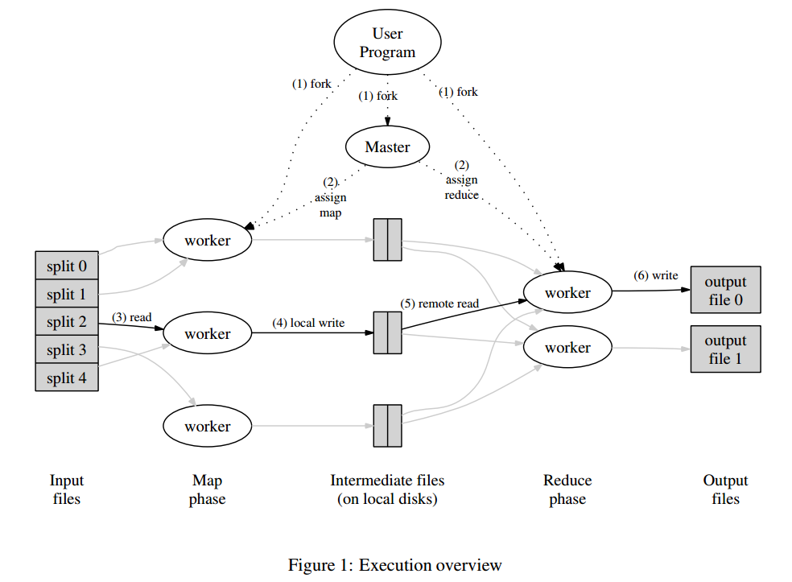

# Introduction

本文是读MapReduce论文的总结。

Google发现有一些应用的计算模型比较简单，但涉及到大量数据，需要成百上千的机器来处理。如何并行化计算、分布数据和处理故障需要复杂的处理，MapReduce的出现即为了解决这个问题。通过提供的编程库，用户能轻松的写出处理逻辑，而内部的并行化计算、数据分布等问题由MapReduce来处理，大大简化了用户的编程逻辑。

MapReduce受到lisp等函数式编程语言的启发，发现大部分的计算任务包括两个处理流程：

- map操作：对每条逻辑记录计算Key/Value对
- reduce操作：对Key/Value按照相同k系统ey进行聚合

接下来，按照如下结构分析MapReduce系统

- Programming Model
- Implementation
- Refinements

# 2 Programming Model

MapReduce的计算以一组Key/Value对为输入，然后输出一组Key/Value对，用户通过编写Map和Reduce函数来控制处理逻辑。

Map函数把输入转换成一组中间的Key/Value对，MapReduce library会把所有相同的Key的中间结果聚合，然后传递给Reduce函数处理。

Reduce函数接收Key和其对应的一组Value，它的作用就是聚合这些Value，产生最终的结果。Reduce的输入是以迭代器的方式输入，使得MapReduce可以处理数据量比内存大的情况。

## 2.1 Example

以经典的word count为例，其伪代码为

```
map(String key, String value):
// key: document name
// value: document contents
for each word w in value:
	EmitIntermediate(w, "1");

reduce(String key, Iterator values):
// key: a word
// values: a list of counts
int result = 0;
for each v in values:
	result += ParseInt(v);
Emit(AsString(result));
```

Map函数吐出(word, count)的K/V对，Reduce把某个单词的所有的count加起来，最终每个单词吐出一个值。

除了Map和Reduce函数之外，用户还需要指定输入和输出文件名，以及一些可选的调节的参数。

## 2.2 Types

Map和Reduce函数的操作可以抽象的表示为

```
map    (k1,v2)          ======>list(k2,v2)
reduce (k2, list(v2))   ======>list(v2)
```

如上所示，map函数生成一系列的K/V中间结果，然后reduce对每个key，聚合其value。

## 2.3 More Examples

**Distributed Grep**

- 对于map，如果输入的行匹配到相应的pattern，则吐出这行
- 对于reduce，仅仅是把map吐出的行拷贝到输出中

**Count of URL Access Frequency**

- 对于map，处理web日志，生成(URL, 1)中间结果
- 对于reduce，聚合相同URL的值，生成(URL, total count)结果

**Reverse Web-Link Graph**

- 对于map，吐出(target, source)中间结果，其中target是被source引用的URL
- 对于reduce，聚合相同target的source，吐出(target, list(source))

**Term-Vector per Host**

Term Vector指的是一篇文档中的(word, frequency)K/V对。

- 对于map，吐出(hostname, term vector)中间结果
- 对于reduce，聚合相同hostname的term vector，吐出最终(hostname, term vector)

**Inverted Index**

- 对于map，吐出一系列的(word, document ID)
- 对于reduce，对相同word，按照document ID排序进行聚合，吐出(word, list(document ID))

**Distributed Sort**

- 对于map，吐出(key, record)中间结果
- 对于reduce，把map的中间结果写入到结果文件中，这里不需要显式地排序，因为MapReduce会自动地排序，方便在reduce的时候进行聚合。

# 3. Implementation

根据不同的环境，MapReduce的实现可以多种多样，例如，基于共享内存的，基于NUMA多核环境的以及基于多台机器组成的集群环境的。

Google的环境如下

- 双核X86系统，运行linux系统，2-4GB内存。
- 100M或1000M带宽网卡
- 集群由大量机器组成，故障是常态
- 每台机器使用廉价的IDE磁盘，采用GFS作为底层存储
- 使用一个调度系统来处理用户的任务

## 3.1 Execution Overview

Map会自动地把输入数据划分成M份，这些数据划分可以并行地被不同机器处理。Reduce按照划分函数划分数据，例如hash(key) mod R，其中R是由用户指定的。下图描述了MapReduce的整个流程，如下



1. MapReduce library会把输入文件划分成多个16到64MB大小的分片（大小可以通过参数调节），然后在一组机器上启动程序。
2. 其中比较特殊的程序是master，剩下的由master分配任务的程序叫worker。总共有M个map任务和R个reduce任务需要分配，master会选取空闲的worker，然后分配一个map任务或者reduce任务。
3. 处理map任务的worker会从输入分片读入数据，解析出输入数据的K/V对，然后传递给Map函数，生成的K/V中间结果会缓存在内存中。
4. map任务的中间结果会被周期性地写入到磁盘中，以partition函数来分成R个部分。R个部分的磁盘地址会推送到master，然后由它转发给响应的reduce worker。
5. 当reduce worker接收到master发送的地址信息时，它会通过RPC来向map worker读取对应的数据。当reduce worker读取到了所有的数据，它先按照key来排序，方便聚合操作。
6. reduce worker遍历排序好的中间结果，对于相同的key，把其所有数据传入到Reduce函数进行处理，生成最终的结果会被追加到结果文件中。
7. 当所有的map和reduce任务都完成时，master会唤醒用户程序，然后返回到用户程序空间执行用户代码。

成功执行后，输出结果在R个文件中，通常，用户不需要合并这R个文件，因为，可以把它们作为新的MapReduce处理逻辑的输入数据，或者其它分布式应用的输入数据。